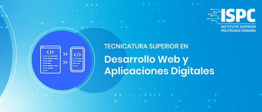

# Actividad Git - GitHub | ISPC TSDWAD

## ¿Que es Scrum?

Scrum es un framework Agile para el desarrollo y el mantenimiento de productos complejos en entornos adaptables. Dividiendolos en pequeñas versiones, entregables al cliente, para recibir feedback

La metodología Scrum se basa en la entrega de un producto, sin terminar, con características funcionales, al cual se le va añadiendo más en la siguiente iteración.

Para ello nace un concepto clave, el Sprint, que es un bloque de tiempo donde el equipo se compromete a entregar un producto iterable con características previamente acordadas

> Ejemplo:
>
> Realizar una barra de navegación responsive, en un tiempo de 12 días, y deberá cumplir con una lista de requerimientos acordada

## Valores de Scrum

Scrum incorpora los valores de:

- compromiso
- coraje
- foco
- apertura
- respeto

# Roles

<!-- Rol Product Owner -->

### Product Owner

El propietario del producto es el responsable de _gestionar efectivamente_ la Pila de Producto (Product Backlog), lo que incluye:

- Desarrollar y comunicar el objetivo m del producto (Meta del producto).
- Crear y comunicar cada uno de los articulos de la pila de producto.
- Ordenar los articulos de la pila de producto siguiendo alguna prioridad.
- Asegurar que la pila de producto sea transparente, visible y comprensible.

Es importante resaltar que al tratarse de el propietario del producto sus decisiones deben respetarse; estas deben ser reflejadas en el contenido y orden en la pila de producto,como asi tambien en el incremento y revision del Sprint.

<!-- Rol Scrum Master -->

### Scrum Master

Es uno de los roles dentro del equipo que se asegura de que la metodología Scrum se desarrolle correctamente. Es un líder al servicio de un equipo el cual elimina impedimentos, ayuda al equipo de desarrollo a ser más productivo y enseña al Product Owner en la gestión del product backlog.

Sus funciones son:

- Organizar las reuniones de planificación de sprints.
- Organizar las reuniones diarias.
- Eliminar obstáculos.
- Ayudar con los trabajos pendientes.
- Realizar análisis retrospectivos.
<!-- Rol Scrum Team -->

# Ceremonia

<!-- Ceremonia Sprint Planning-->

### Daily Scrum Meeting

Es una reunión periódica. Se produce diariamente, y tiene un máximo de
20 min. de duración. Tiene por objeto tratar qué es lo que se hizo, qué se va a hacer y
qué problemas se han encontrado, esto a fines de encontrar soluciones en la diaria

<!-- Ceremonia Daily Scrum-->

<!-- Ceremonia Sprint Review-->
### Sprint Review

Se produce al finalizar el Sprint y
tiene por objeto mostrar qué es lo que se ha completado y qué no. Debe estar presente el
Product Owner.

- El equipo presenta la funcionalidad terminada al Product Owner y demás
stakeholders.
- Los miembros del equipo responden preguntas de los stakeholders en relación a la
demostración, y toman nota de los cambios propuestos.
- Al finalizar la presentación, los stakeholders dan su impresión acerca del producto, cambios deseados y
prioridad de esos cambios.

<!-- Ceremonia Sprint Retrospective-->

# Artefactos

<!-- Artefacto Product Backlog -->

<!-- Artefacto Sprint Backlog -->

<!-- Artefacto Impediments Backlog -->
### Impediments Backlog

Es una lista de impedimentos, similar al product backlog, que se van detectando durante el Sprint. El Scrum Master es responsable de disolver estos impedimentos encontrados

<!-- Artefacto Burndown Chart -->
### Burndown Chart

Es un gráfico que ayuda a motorizar el progreso del equipo, gestionar riesgos y estipular si se podrá cumplir o no un sprint. Se realiza un histograma con un trazo esperado de tareas a completar, y sobre este se coloca el avance
